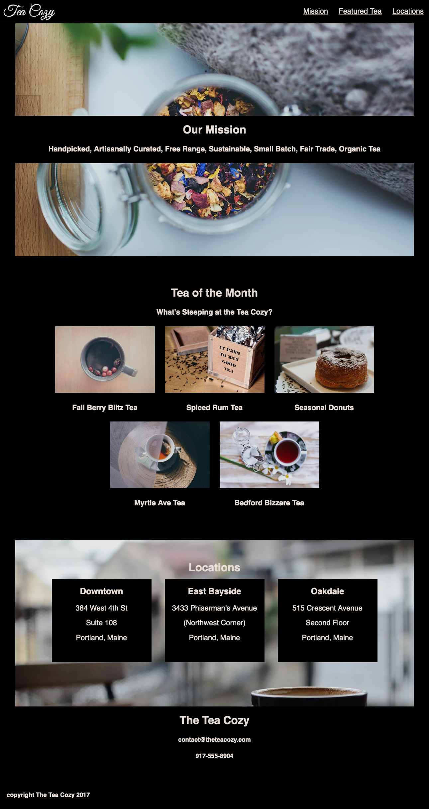

# Tea Cozy

This is an advanced HTML/CSS CodeCademy project, done on my own computer. It's a website for a fictional tea shop.

## Description

The project's task was to reproduce a given website, starting from scratch with this design specification:

This is how my solution to the project looks like:

## Built with:

* Visual Studio Code
* HTML5
* CSS3 (flexbox and box model)
* Markdown

## Run
Download the respository and open index.html in a browser. 

